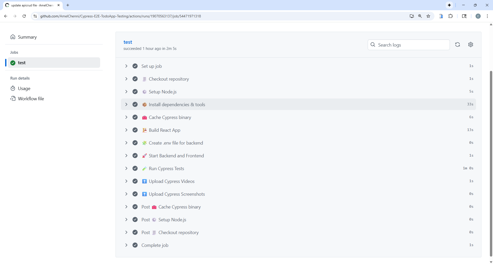
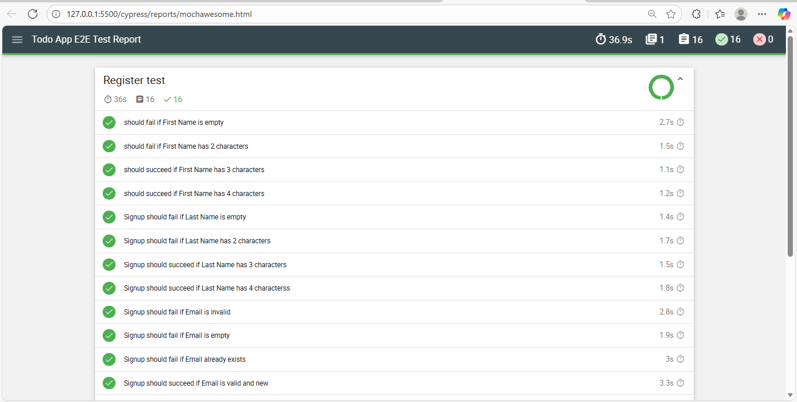
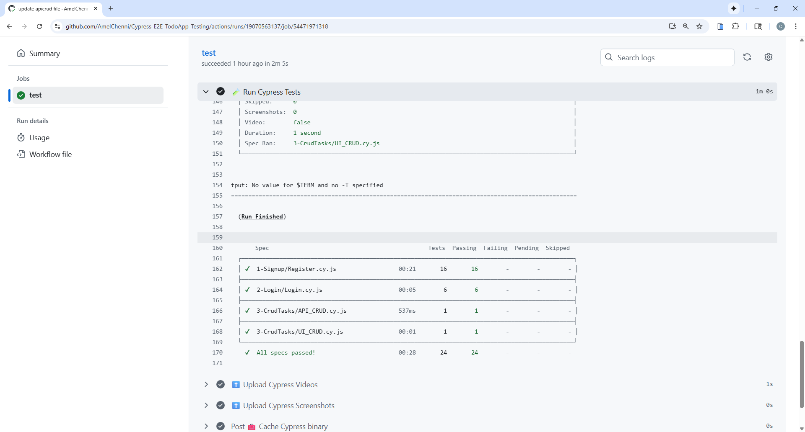
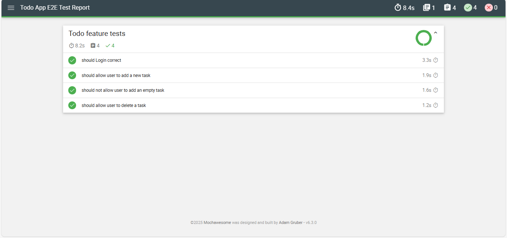
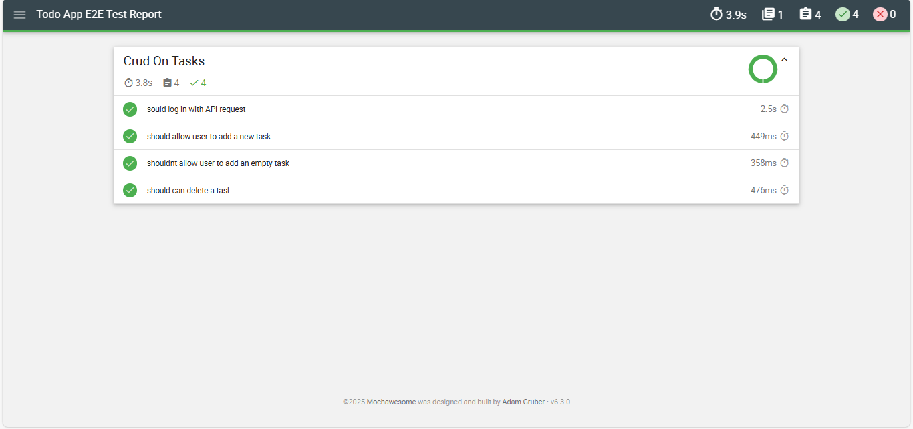
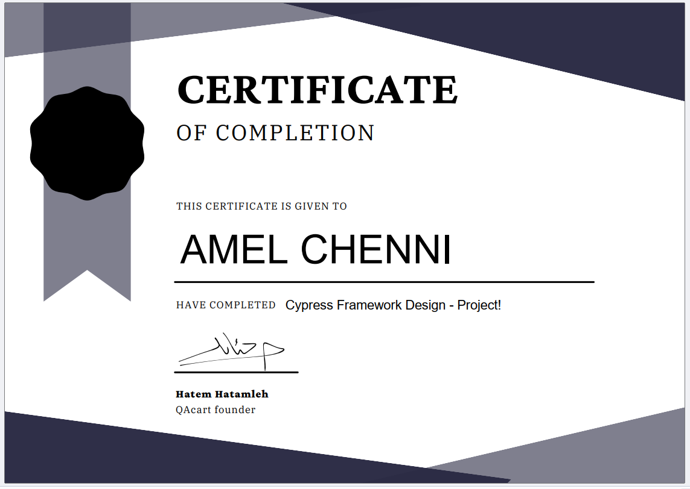

# ✅ Todo App — Cypress E2E Automation Project

<!-- Badges -->


[📊 View Full Mochawesome Report](cypress/reports/mochawesome.html)


This project is a complete **End-to-End (E2E) Automation Testing** framework for a Todo web application using **Cypress**.  
The UI is not developed by me, but **all automation scripts are written by me**.

---

## 🎯 Project Objectives

- Test CRUD operations for Todo tasks, leveraging both **UI and API** layers.
- Implement **Page Object Model (POM)** for structured and maintainable code.
- Utilize **API-based Login** for session management and faster test execution.
- Cover both positive and negative scenarios using **Data-Driven Testing**.
- Generate automated reports with **Mochawesome** for detailed test results.

---

## 🧰 Tech Stack

| Tool | Purpose |
| :--- | :--- |
| **Cypress** | Primary UI & API Testing Framework |
| **JavaScript** | Test scripting |
| **Custom Commands** | Reusable functions for common tasks (`cy.login`, `cy.addTask`) |
| **Faker.js** | Randomized and dynamic test data generation |
| **GitHub Actions** | Continuous Integration (CI) for automated runs |
| **Mochawesome** | Generating comprehensive HTML test reports |

---

## 📂 Project Structure

* **cypress/**
    * **e2e/** (Test Specs)
        * 01-Tests/
            * 01-Signup/Register.cy.js (UI Data-Driven Signup tests)
            * 02-Login/Login.cy.js (UI Data-Driven Login tests)
            * 03-CrudTasks/API_CRUD.cy.js (Pure API tests)
            * 03-CrudTasks/UI_CRUD.cy.js (UI tests)
    * **02-Pages/** (Page Object Model - POM)
        * 01-SignupPage.js
        * 02-LoginPage.js
        * 03-AddTasksPage.js
    * **03-testData/** (Test Data)
        * 01-SignupData.js
        * 02-LoginData.js
        * 03-AddTasksData.js
    * fixtures/
    * support/
        * commands.js (Reusable API and UI commands)
* **docs/** (Manual QA Artifacts)
    * TestPlan.pdf
    * TestCases.xlsx
    * BugReport.pdf
    * ExecutionReport.pdf

---

## 🔧 Running the Project

### 1. Install Dependencies
```bash
npm install
```
### 2. Open Cypress GUI (Interactive Mode)
```bash
npm install
npm run cypress:open 
# Or: npx cypress open```

- Use this mode to run and debug tests interactively.
- Choose the spec file you want to execute.
```
### 3. Run Cypress Headless (CI / Command Line Mode)

``` npm run cypress:run 
# Or: npx cypress run ```
- Executes all tests in headless mode.
- Generates test reports automatically.
```
### 4. Mochawesome Test Reports
- After running tests, open the HTML report at: cypress/reports/mochawesome.html
- The report contains:
    - Passed / Failed tests
    - Screenshots for failed tests
    - Execution statistics and charts

### 5. Notes
- Make sure your local server is running at http://localhost:3000 before executing tests.
- Use environment variables for sensitive data (email/password) via cypress.config.js or .env file.

---

## Test Coverage

| Feature | Test Type | Status |Key Command Used |
|---------|-----------|--------|-----------------|
| Signup | UI / API | ✅ Passed |cy.fillBasicInfo|
| Login | UI / API | ✅ Passed |cy.login (API Request for token)|
| Add Task | UI / API | ✅ Passed |cy.addTask (API Request/UI interaction)|
| Add Empty Task | UI / API | ✅ Passed |cy.addEmptyTask (API Request/UI interaction)|
| Delete Task | UI / API | ✅ Passed |cy.delete (API Request/UI interaction)|
| Form Validations | UI / API | ✅ Passed |Data-Driven approach|

---

## API & Database Testing

- API endpoints tested:
    - POST /api/v1/users/login ✅
    - POST /api/v1/tasks ✅
    - GET /api/v1/tasks ✅
    - DELETE /api/v1/tasks/:id ✅
- Used authorization headers for secure API calls
- Verified response payloads and status codes
- Validated task creation, deletion, and error scenarios

---


# 📊 Screenshots & Test Reports

## 1️⃣ Register Feature

### GitHub Actions Result


### Mochawesome Report


---

## 2️⃣ Login Feature

### GitHub Actions Result


### Mochawesome Report


---

## 3️⃣ CRUD Feature

### Mochawesome Report


---

## 4️⃣ Code Preview


---

## 🎓 Course Certificate

This project is the culmination of dedicated study and reflects:

- **Rapid Learning:** Ability to master and implement advanced automation concepts in a very short timeframe.
- **Best Practices:** Focus on maintainability, reusability, and performance through POM (Page Object Model) and API session management.
- **Completed Cypress Automation Bootcamp**

### Certificate & Tools

#### Certificate



---

## About the Project

This project demonstrates:  
- Practical experience in UI & API Automation  
- Using Cypress best practices  
- Writing maintainable, reusable, and data-driven tests

---

## Links

[GitHub Repository](https://github.com/AmelChenni/Cypress-E2E-TodoApp-Testing)
[LinkedIn Portfolio](https://www.linkedin.com/in/amel-chenni/)

---

## Contact

- Email: chenniamel45@gmail.com

